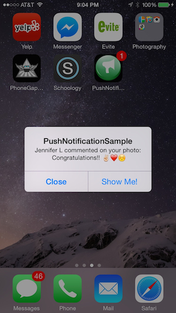

Push Notification Sample App
============================
A sample mobile app built with Ionic and ngCordova to demonstrate how to register for and receive push notifications. Once
the device registration token is received it is sent to a locally running node service to be stored for later push notifications 
in a mongodb db using [node-pushserver](https://www.npmjs.org/package/node-pushserver). Modify the URL in the controllers.js
 file to match your own setup.

*sendMsg.js* is another node service I've written and included to show an example of different ways to configure push 
notifications as well and can be run manually as long as the [node-apn](https://github.com/argon/node-apn) library has
been installed.

*subscribe.js* is yet another node service that can be used to manually add a user and token into your locally running push-server
instance.

 

###ngCordova
`ngCordova` is an AngularJS wrapper library for working with Cordova plugins. It's essentially a set of directives
implemented with promises to help keep your plugin code clean, organized and more maintainable.  

Install the following plugins:

- [PushPlugin](https://github.com/phonegap-build/PushPlugin)
- console
- device
- dialogs
- media
- file

        $ ionic plugin add org.apache.cordova.console
        $ ionic plugin add org.apache.cordova.device
        $ ionic plugin add org.apache.cordova.dialogs    
        $ ionic plugin add org.apache.cordova.file
        $ ionic plugin add org.apache.cordova.media
        $ ionic plugin add https://github.com/phonegap-build/PushPlugin

###Push Notification Sample Node Service node-apn
This sample also includes a node service example called sendMsg.js for sending push notifications using the [node-apn](https://github.com/argon/node-apn)
library. 
 
###node-pushserver 
Check out [node-pushserver](https://www.npmjs.org/package/node-pushserver) to manage push notifications and device tokens with mongodb. This sample includes a subscribe.js file
sample node/express service which can be used to subscribe a user and token for push notifications. You can then send push notifications
from your web browser easily simply using their UI as shown below. 

 
