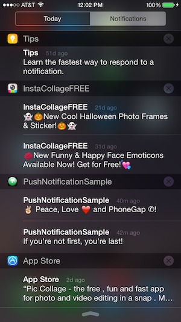
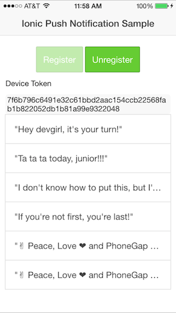
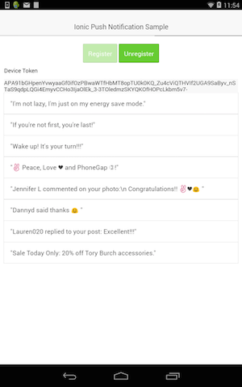
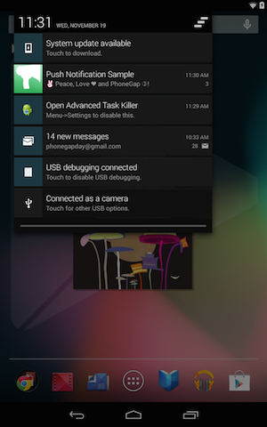
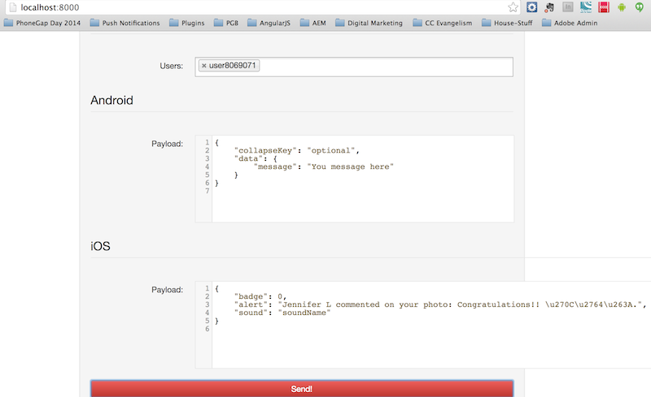

Push Notification Sample App
============================
A sample mobile application built with [Ionic](http://ionicframework.com) and [ngCordova](http://ngcordova.com/) to demonstrate how to register for and receive push notifications on iOS
and Android. Once the device registration token is received, it is sent to a locally running node service where it will be stored for 
later use when a push notification needs to be broadcast to all subscribed devices using [node-pushserver](https://www.npmjs.org/package/node-pushserver). 
The setup to use node-pushserver is discussed more below but see the npm site for specific setup details. 

  

### Push Notification Sample on iOS
 

### Push Notification Sample on Android Nexus 7
   

###ngCordova
`ngCordova` is an AngularJS wrapper library for working with Cordova plugins. It's essentially a set of AngularJS directives
to help keep your plugin code clean, organized and more maintainable. I've included the library already in the /lib folder
but you will need to be sure all of the required plugins are installed:

### ** PRE-REQUISITES 

You must install the following plugins for this app to work properly!

- console
- device
- dialogs
- media
- file
- [PushPlugin](https://github.com/phonegap-build/PushPlugin)
- [ToastPlugin](https://github.com/EddyVerbruggen/Toast-PhoneGap-Plugin) 

        $ ionic plugin add org.apache.cordova.console
        $ ionic plugin add org.apache.cordova.device
        $ ionic plugin add org.apache.cordova.dialogs    
        $ ionic plugin add org.apache.cordova.file
        $ ionic plugin add org.apache.cordova.media
        $ ionic plugin add https://github.com/phonegap-build/PushPlugin
        $ ionic plugin add https://github.com/EddyVerbruggen/Toast-PhoneGap-Plugin.git

## Sending Push Notifications to your App

A couple options are included for sending push notifications to this application. You can use node-pushserver to store multiple device tokens
from different platforms and send in bulk, or if you just want to test sending one simple message, there are two simple node services included
to do that as well (node-apn and node-gcm). 

### Sending to Multiple Devices And Storing Tokens (better approach)
####node-pushserver 
Check out [node-pushserver](https://www.npmjs.org/package/node-pushserver) to manage push notifications and device tokens with [mongodb](www.mongodb.org) database. This sample includes a subscribe.js file
sample node/express service which can be used to subscribe a user for push notifications from the app. You can then send push notifications
from your the web browser easily and quickly using their UI as shown here. 

*The app is currently setup to point to my local instance of pushserver so you can just change it to your URL to use this approach.*

 

When the app starts it will automatically try to register the user for push notifications. It will then retrieve the device token from the result
and store it with the platform type (ios, android) (along with a random user name currently) thru a call to the node-pushserver API 
into a [mongodb](www.mongodb.org) database. You
will need to provide your mongodb database name and configuration details to use node-pushserver in the config.json file as shown in 
[Step 3 here](https://www.npmjs.org/package/node-pushserver) and supply the path to your version of the file when you start it up. 

Then modify the URL in the project js/controllers.js file to match your own 
setup. If you're running your node-pushserver instance from localhost, you may have to provide the explicit URL from your local network settings such as below:  

*Change this line in PushNotificationSample/www/js/controllers.js to match your own network URL where you're running node-pushserver:*
    
    $http.post('http://192.168.1.5:8000/subscribe', JSON.stringify(user)

### Sending to *One Device* Manually (quick testing)

*The app is currently setup to receive push notifications from this approach as well. You just need to update the sendMsg.js or sendGCM.js files
 to use your device tokens and certificates as needed.*

#####iOS (APNS) Simple Node Service to send push notifications
I've also included a node service example called sendMsg.js for sending push notifications using the [node-apn](https://github.com/argon/node-apn)
library to your iOS devices. Run this manually with your own configuration from node.

  `$ node sendMsg.js`
 
#####Android (GCM) node-gcm Simple Node Service to send push notifications
This sample also includes a node service example called sendGCM.js for sending push notifications using the [node-gcm](https://github.com/ToothlessGear/node-gcm)
library to your Android devices. 
  
  `$ node sendGCM.js`

#####Extra
*subscribe.js* is yet another node service that can be used to manually add a user and token into your locally running node-pushserver instance
instance.
  
  `$ node subscribe.js`

####Resources - HIGHLY RECOMMENDED REFERENCES

The answers to your questions about Apple Push Notifications and Google Cloud Messaging configuration will be found in these previous 
posts. If you're not familiar with the setup, you will save yourself headache at least reading thru the configuration portion
for each. You will need certain resources from them and have to specifically enable your iOS for Push Notifications thru the Apple
Developer site. 

1-[Very explanatory post](http://blogs.telerik.com/appbuilder/posts/14-01-14/let's-get-push-notifications-working-in-phonegap-and-ios?utm_content=buffer751c3&utm_medium=social&utm_source=app.net&utm_campaign=buffer) with screenshots 
by [Burke Holland](https://twitter.com/burkeholland) to walk you through Apple Push Notification setup. 

2-[My tutorial on iOS/Apple Push Notifications](http://devgirl.org/2012/10/19/tutorial-apple-push-notifications-with-phonegap-part-1/)  

3-[My tutorial on Android/GCM](http://devgirl.org/2012/10/25/tutorial-android-push-notifications-with-phonegap/)

4-[My PushPlugin Basic Tutorial](http://devgirl.org/2013/07/17/tutorial-implement-push-notifications-in-your-phonegap-application/)

